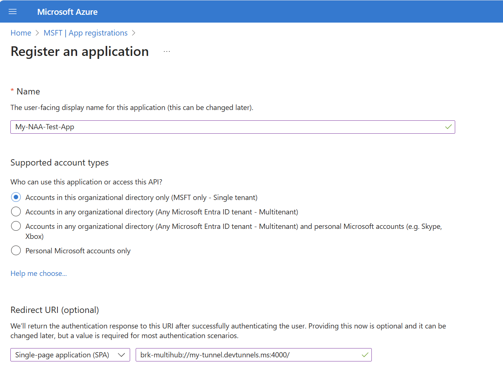

# naa-test-app-local

## How to run this app and test nested app authentication

### Prerequisites

To sideload this app to a host that supports nested app authentication you will need:

1. A localhost tunnel such as those provided by [Microsoft dev tunnels](https://learn.microsoft.com/en-us/azure/developer/dev-tunnels/get-started?tabs=windows) or [ngrok](https://ngrok.com/).

2. A Microsoft Entra ID tenant which you can use for testing. This tenant must have the ability to create Microsoft Entra ID app registrations and must a user with the ability to upload custom app packages to a host such as Teams. To create a test tenant, visit the [Microsoft 365 Developer Program dashboard](https://developer.microsoft.com/en-us/microsoft-365/profile).

### 1. Create and start your tunnel

Using your tunnel provider (such as Microsoft dev tunnels or ngrok), create a secure tunnel from a public endpoint to localhost port 4000.

For example, using Microsoft devtunnel:

```
devtunnel create -a
devtunnel port create -p 4000 --protocol https
devtunnel host
```

This will create and host a new dev tunnel that connects a public endpoint to `localhost:4000`. Note the URL of this endpoint; it will be required in later steps.

### 2. Create a Microsoft Entra ID registration for your test app

Go to [Azure portal](https://portal.azure.com/#home) and sign in with an admin account in your test tenant.

Select the "Microsoft Entra ID" service. In the menu at the left side of the page select "App registrations". Then, click the "New registration" button at the top of the page.

Enter a name for your test application, select "Accounts in this organizational directory only" for supported account types, and then under "Redirect URI" select "Single-page application (SPA)" as the platform and enter "brk-multihub://" + the domain of your tunnel. For example, if the public endpoint of your tunnel is `https://my-tunnel.devtunnels.ms:4000/` then the URI here should be `brk-multihub://my-tunnel.devtunnels.ms:4000/`



Click the "Register" button.

This will create the app registration. Note the application ID under "Application (client) ID" and the tenant ID under "Directory (tenant) ID" on the Overview page. These will be required in later steps.

### 3. Update the .env file with your app information.

In the .env file at the root of this project, replace the CLIENT_ID value with the application ID you noted from step 2, the AUTHORITY value with "https://login.microsoftonline.com/common" or "https://login.microsoftonline.com/\<TENANT-ID\>" where \<TENANT-ID\> is the tenant ID you noted from step 2, the APP_URL value with your tunnel endpoint (e.g. `https://my-tunnel.devtunnels.ms:4000/`), and APP_DOMAIN with your tunnel domain (e.g. `my-tunnel.devtunnels.ms:4000/`).

Optionally, you may provide SSL key and certificate files for Webpack by specifying paths to these files in SSL_KEY_FILE and SSL_CRT_FILE respectively, but this is not required for testing.

### 4. Start the app

From the project root, run `npm run start` to start running the test app locally. You can verify the app is running by visiting https://localhost:4000/. At this point, if you intend to test the app in a host, visit the endpoint of the tunnel you started in step 1 to make sure it returns the app.

### 5. Sideload the app on Teams (or other hosts)

From the project root, run `npm run generateAppPackage`. This will create a `appPackage.zip` archive at the root of the project.

Log into Teams with an account from your tenant with the permission to upload a custom app.

On the left rail, select "Apps", and then at the bottom of the Apps menu select "Manage your apps".

Select the "Upload an app" button, and then the "Upload" button under "Upload a custom app" when the popup appears. Then select the `appPackage.zip` archive that was just created.


Click the "Add" button and then the "Open" button. This should open the app inside of Teams.]

### 6. Test the app

If you have correctly configured the application, calling the "isNAAChannelRecommended" API should return true, calling the "Initialize public client application" API should return an object describing the PCA configuration, calling the "Get auth token" API should return an authentication token, calling the "Get active account" API should return an object describing the current user, and calling the "Get user info from Graph" API should return an object describing the current user as retrieved from Microsoft graph using an authentication token obtained through MSAL nested app authentication.